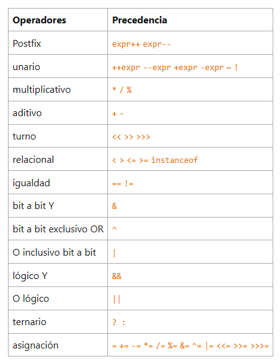
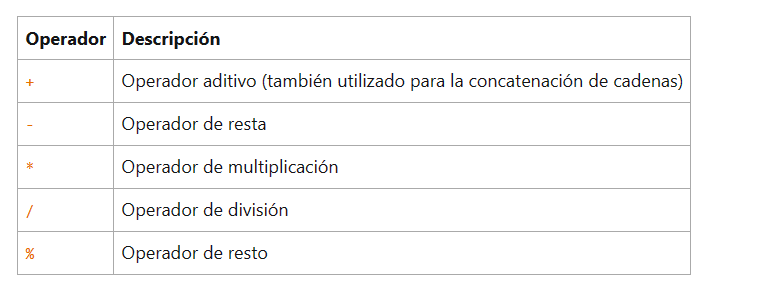

## Operadores



## operador de asignacion simple

````
package com.var;

import java.util.List;

public class Main {
    public static void main(String[] args) {

        int numero = 0;
        int contador = 0;
        int velocidad = 0;
    }
}
````

## Operadores Aritmeticos



````

package com.var;

import java.util.List;

public class Main {
    public static void main(String[] args) {

       /*operadores aritmeticos */
       /*suma */
       int resultado = 1+5;
       System.out.println("1+5=  "+resultado);
        int resultadoOriginal = resultado;
       /*resta*/
       resultado = resultado - 2;
       System.out.println(resultadoOriginal+"-2 = "+ resultado);
        resultadoOriginal =resultado;

        /*multiplicar */
        resultado = resultado * 6;
        System.out.println(resultadoOriginal+" *6 =" +resultado);
        resultadoOriginal = resultado;

        /*Dividir */
    
        resultado = resultado /2;
        System.out.println(resultadoOriginal+"/2="+resultado );
        resultadoOriginal = resultado;

        /*operador de resto */
        resultado = resultado % 5;
        System.out.println(resultadoOriginal+"%5= " +resultado);
    
    
    }   }
````

