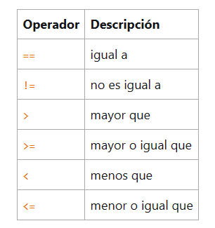
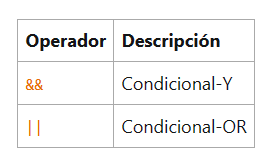

## Operadores


## operador de asignacion simple

````
package com.var;

import java.util.List;

public class Main {
    public static void main(String[] args) {

        int numero = 0;
        int contador = 0;
        int velocidad = 0;
    }
}
````

## Operadores Aritmeticos


````

package com.var;

import java.util.List;

public class Main {
    public static void main(String[] args) {

       /*operadores aritmeticos */
       /*suma */
       int resultado = 1+5;
       System.out.println("1+5=  "+resultado);
        int resultadoOriginal = resultado;
       /*resta*/
       resultado = resultado - 2;
       System.out.println(resultadoOriginal+"-2 = "+ resultado);
        resultadoOriginal =resultado;

        /*multiplicar */
        resultado = resultado * 6;
        System.out.println(resultadoOriginal+" *6 =" +resultado);
        resultadoOriginal = resultado;

        /*Dividir */
    
        resultado = resultado /2;
        System.out.println(resultadoOriginal+"/2="+resultado );
        resultadoOriginal = resultado;

        /*operador de resto */
        resultado = resultado % 5;
        System.out.println(resultadoOriginal+"%5= " +resultado);
    
    
    }   }

````

* Con el + se puede hacer concatenaciones 

````
package com.var;

import java.util.List;

public class Main {
    public static void main(String[] args) {

         String nombre = "angie";
        String apellido = "Duran";
        String nombreCompleto= nombre+apellido;
        System.out.println(nombreCompleto);


    }
}

````

## Operadores Unarios


````
package com.var;

import java.util.List;

public class Main {
    public static void main(String[] args) {

        /*operadores Unarios */

        int result = +1;  /*indica que es positivo */
        System.out.println(result);

        result --;

        System.out.println(result);

        result ++;

        System.out.println(result);


        result = -1;
        System.out.println(result);


        boolean success= false;
        System.out.println(success);
        System.out.println(!success);
    }
}


````
* Los operadores de incrementos / decremento se puede aplicar antes (prefijo) o despues (sufijo) del operador  

````

        int i = 3;
        i++;
        System.out.println(i);
        ++i;
        System.out.println(i);
        System.out.println(i++);
        System.out.println(++i);
        

````

## La igualdad y los operadores relacionales



````
package com.var;

import java.util.List;

public class Main {
    public static void main(String[] args) {

        int value1 = 1;
        int value2 = 2;
        if(value1 == value2){
            System.out.println("value1 == value2");
        }if (value1 != value2) {
            System.out.println("value1 != value2");
            
        }if (value1>value2) {
            System.out.println("value1 > value2");
            
        }if (value1<value2) {
            System.out.println("value1<value2");
        }if (value1<=value2) {
            System.out.println("value1 <= value2");
        }
    
    }
}
````

## Operadores condicionales



````
    public static void main(String[] args) {

        int value1 = 1;
        int value2 = 2;
        int result;
        boolean someCondition = true;
        result = someCondition ? value1:value2;
        System.out.println(result);
    }

````

````
package com.var;

import java.util.List;

public class Main {
    public static void main(String[] args) {

        int value1 = 1;
        int value2 = 2;
         
        if ((value1 == 1) && (value2 == 2)) {
            System.out.println("value1 and value2");
            
        }if ((value1==1) || (value2==2)) {
            System.out.println("value1 or value2");

        }
    
    }
}

````

## El operador de comparación de tipos instanceof

es un comparador con un objeto de tipo especificado

* creamos una clase llamada Parent()

* creamos una clase llamada Child y lo extendemos con la clase Parent y se implementa con MyInterface

* Se crea una interfaz llamada MyInterface

y en el main se creara lo siguiente: 

```

package com.var;

import java.util.List;

public class Main {
    public static void main(String[] args) {

    Parent obj1 = new Parent();
    Parent obj2 = new Child();

    System.out.println(obj1 instanceof Parent);
    System.out.println(obj1 instanceof Child);
    System.out.println(obj1 instanceof MyInterface);
    System.out.println(obj2 instanceof Parent);
    System.out.println(obj2 instanceof Child);
    System.out.println(obj2 instanceof MyInterface);


    }
}

```

## Operadores bit a bit y bit shift

El operador bit a bit realiza una operación AND bit a bit.&

El operador bit a bit realiza una operación OR exclusiva bit a bit.^

El operador bit a bit realiza una operación OR inclusiva bit a bit.

````

package com.var;

import java.util.List;

public class Main {
    public static void main(String[] args) {

   int bikmask= 0x000f;
   int val = 0x2222;
   System.out.println(val & bikmask);


    }
}

````
